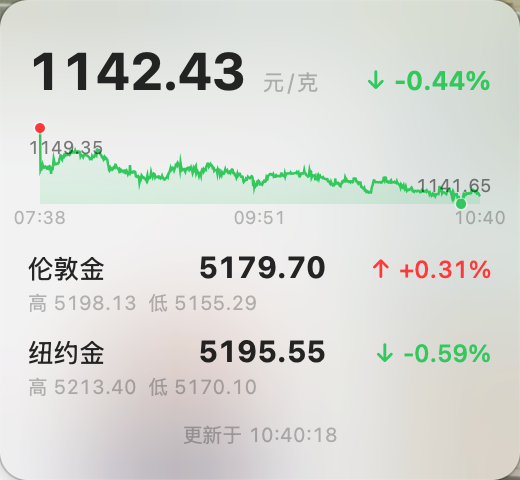
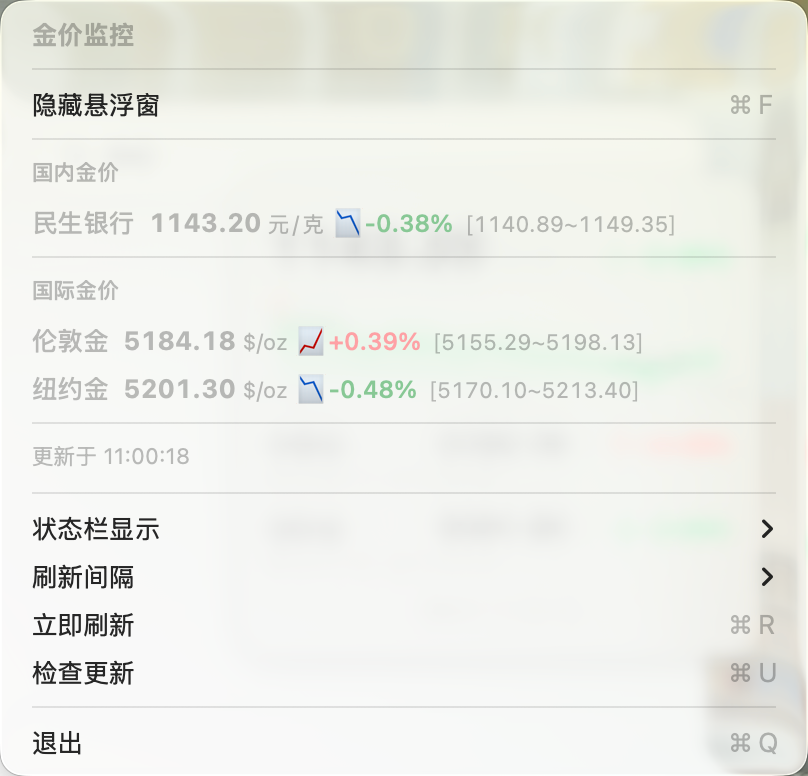

# GoldPrice

<p align="center">
  
</p>

<p align="center">
  <b>macOS 菜单栏黄金价格监控</b>
</p>

<p align="center">
  
  
  
</p>

## 致谢

本项目 Fork 自 [PiaoyangGuohai1/GoldPrice](https://github.com/PiaoyangGuohai1/GoldPrice)，感谢原作者的出色工作。

## 新版特性 (v2.0.0)

本版本在原项目基础上进行了重大升级：

- **📈 24小时走势图** - 悬浮窗内嵌迷你走势图，直观展示价格波动趋势
- **🎯 日内高低价** - 实时标记24小时内的最高价与最低价
- **💾 历史数据持久化** - 价格数据本地保存，重启不丢失
- **🎨 渐变填充图表** - 走势线配合渐变填充，视觉效果更佳
- **⚡ 5秒刷新** - 更快的默认刷新间隔，数据更实时

## 功能概览

| 功能 | 说明 |
|------|------|
| 菜单栏显示 | 实时金价 + 涨跌幅，可切换数据源 |
| 悬浮窗 | 可拖拽，始终置顶，含走势图 |
| 国内金价 | 民生银行积存金 |
| 国际金价 | 伦敦金 (XAU)、纽约金 (COMEX) |
| 涨跌颜色 | 涨红跌绿 |

## 截图

### 悬浮窗（含走势图）
<p align="center">
  
</p>

### 菜单栏下拉菜单
<p align="center">
  
</p>

## 安装

### 直接下载
从 [Releases](https://github.com/BigKunLun/GoldPrice/releases) 下载最新版本，解压后将 `GoldPrice.app` 拖入 `/Applications` 文件夹。

### 绕过安全检查
由于应用未经过 Apple 公证，首次运行可能会被 macOS 拦截。解决方法：

```bash
xattr -cr /Applications/GoldPrice.app
```

或者在 **系统设置 → 隐私与安全性** 中点击「仍要打开」。

### 从源码编译
```bash
git clone https://github.com/BigKunLun/GoldPrice.git
cd GoldPrice
./build.sh
open GoldPrice.app
```

## 快捷键

| 快捷键 | 功能 |
|--------|------|
| ⌘F | 显示/隐藏悬浮窗 |
| ⌘R | 立即刷新 |
| ⌘Q | 退出 |

## 数据来源

- **国内金价**：京东金融 API（民生银行积存金）
- **国际金价**：新浪财经 API（伦敦金 XAU、纽约金 GC）

## 技术栈

- Swift 5.9 + AppKit
- 无第三方依赖
- macOS 12.0+

## License

MIT License
